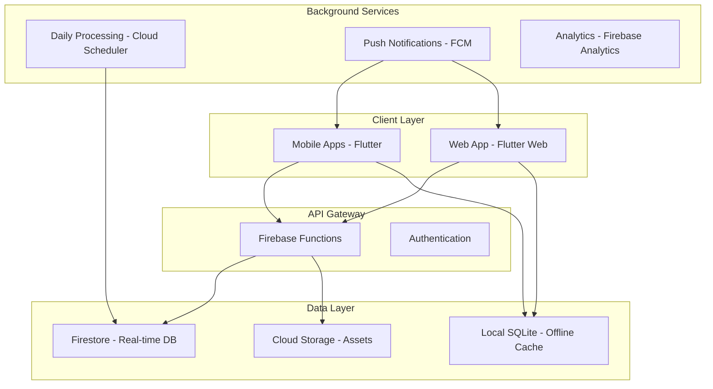

# Design Document - SyncLife

## Overview

SyncLife é um aplicativo de tarefas colaborativo multiplataforma que implementa gamificação profunda através de um sistema RPG da vida real. O sistema é projetado com arquitetura offline-first para garantir funcionalidade contínua independente da conectividade, com sincronização em tempo real quando online.

A arquitetura segue padrões modernos de desenvolvimento mobile com foco em performance, escalabilidade e experiência do usuário consistente across platforms (Android, iOS, Web).

## Architecture

### High-Level Architecture



### Technology Stack

**Frontend:**
- **Flutter 3.24+**: Cross-platform framework para mobile e web
- **Dart**: Linguagem de programação
- **Riverpod**: State management e dependency injection
- **SQLite (sqflite)**: Local database para offline-first
- **Shared Preferences**: Configurações locais

**Backend:**
- **Firebase Firestore**: NoSQL database com real-time sync
- **Firebase Functions**: Serverless compute para business logic
- **Firebase Authentication**: Sistema de autenticação
- **Firebase Cloud Messaging**: Push notifications
- **Cloud Scheduler**: Processamento batch diário

**DevOps:**
- **Firebase Hosting**: Web app deployment
- **Google Play Console / App Store Connect**: Mobile app distribution
- **Firebase Crashlytics**: Error tracking e analytics

## Components and Interfaces

### Core Components

#### 1. Authentication Service
```dart
abstract class AuthService {
  Future<User?> signInWithGoogle();
  Future<User?> signInWithApple();
  Future<User?> signInWithEmail(String email, String password);
  Future<void> signOut();
  Stream<User?> get authStateChanges;
}
```

#### 2. Task Management Service
```dart
abstract class TaskService {
  Future<List<Task>> getTasks(String boardId);
  Future<Task> createTask(CreateTaskRequest request);
  Future<Task> updateTask(String taskId, UpdateTaskRequest request);
  Future<void> deleteTask(String taskId);
  Future<void> completeTask(String taskId);
  Stream<List<Task>> watchTasks(String boardId);
}
```

#### 3. Board Management Service
```dart
abstract class BoardService {
  Future<List<Board>> getUserBoards();
  Future<Board> createBoard(CreateBoardRequest request);
  Future<String> generateInviteLink(String boardId);
  Future<void> joinBoard(String inviteCode);
  Stream<List<Board>> watchUserBoards();
}
```

#### 4. Gamification Service
```dart
abstract class GamificationService {
  Future<UserStats> getUserStats(String userId);
  Future<List<Achievement>> getUserAchievements(String userId);
  Future<void> processDaily(String userId);
  Stream<UserStats> watchUserStats(String userId);
}
```

#### 5. Sync Service (Offline-First)
```dart
abstract class SyncService {
  Future<void> syncPendingChanges();
  Future<void> queueChange(SyncOperation operation);
  Stream<SyncStatus> get syncStatus;
  bool get isOnline;
}
```

### Data Models

#### Task Model
```dart
class Task {
  final String id;
  final String title;
  final String? description;
  final String boardId;
  final String? assignedTo;
  final TaskRecurrence recurrence;
  final DateTime? dueDate;
  final bool isCompleted;
  final List<String> tags;
  final DateTime createdAt;
  final DateTime updatedAt;
  final String createdBy;
}

enum TaskRecurrence {
  none,
  daily,
  weekly,
  monthly,
  custom
}
```

#### Board Model
```dart
class Board {
  final String id;
  final String name;
  final String? description;
  final BoardType type;
  final String ownerId;
  final List<String> memberIds;
  final BoardSettings settings;
  final DateTime createdAt;
  final DateTime updatedAt;
}

enum BoardType {
  private,
  shared
}
```

#### User Stats Model
```dart
class UserStats {
  final String userId;
  final int totalXP;
  final int level;
  final int fluxoCoins;
  final int currentStreak;
  final int longestStreak;
  final Map<String, int> categoryXP;
  final DateTime lastActive;
  final DateTime updatedAt;
}
```

### Offline-First Synchronization Strategy

#### Conflict Resolution
1. **Last-Write-Wins**: Para task completion status
2. **Merge Strategy**: Para task content updates
3. **User Resolution**: Para conflitos complexos

#### Sync Queue Implementation
```dart
class SyncOperation {
  final String id;
  final SyncOperationType type;
  final Map<String, dynamic> data;
  final DateTime timestamp;
  final int retryCount;
}

enum SyncOperationType {
  createTask,
  updateTask,
  deleteTask,
  completeTask,
  createBoard,
  joinBoard
}
```

## Correctness Properties

*A property is a characteristic or behavior that should hold true across all valid executions of a system-essentially, a formal statement about what the system should do. Properties serve as the bridge between human-readable specifications and machine-verifiable correctness guarantees.*

Agora vou analisar os critérios de aceitação para identificar propriedades testáveis:

### Property Reflection

Após analisar todos os critérios de aceitação, identifiquei algumas redundâncias que podem ser consolidadas:

- Propriedades 5.2, 5.3, 5.4 podem ser combinadas em uma propriedade geral sobre compras na loja
- Propriedades 9.3 e 9.4 podem ser combinadas em uma propriedade sobre benefícios Premium
- Propriedades 2.2 e 2.6 podem ser combinadas em uma propriedade sobre conclusão de tarefas

### Correctness Properties

Property 1: User registration creates default board
*For any* user completing registration, the system should create exactly one private board with the user as owner
**Validates: Requirements 1.3**

Property 2: Region detection from GPS
*For any* valid GPS coordinates provided during registration, the system should correctly detect and set the corresponding region and timezone
**Validates: Requirements 1.2**

Property 3: Language override capability
*For any* user and any supported language, the system should allow manual language changes regardless of detected region
**Validates: Requirements 1.4**

Property 4: Data synchronization on login
*For any* user login event, all user data should be synchronized across all their active devices
**Validates: Requirements 1.5**

Property 5: Task creation with recurrence
*For any* valid task data and recurrence type (daily, weekly, monthly, specific date), the system should successfully create the task with correct recurrence settings
**Validates: Requirements 2.1**

Property 6: Task completion feedback
*For any* task marked as complete, the system should play success sound, show visual feedback, and update task status
**Validates: Requirements 2.2, 2.6**

Property 7: Task postponement
*For any* recurring task that is postponed, the system should schedule it for the next occurrence based on its recurrence pattern
**Validates: Requirements 2.3**

Property 8: Inbox to task conversion
*For any* inbox item dragged to a valid date, the system should convert it to a scheduled task with that due date
**Validates: Requirements 2.5**

Property 9: Invite link uniqueness
*For any* board requiring an invite link, the system should generate a unique URL that doesn't conflict with existing links
**Validates: Requirements 3.3**

Property 10: Real-time board synchronization
*For any* user joining a shared board, all task updates and changes should be synchronized in real-time across all board members
**Validates: Requirements 3.5**

Property 11: Daily XP calculation
*For any* user with completed tasks, the daily processing should calculate XP based on task completion and categorize it by tags
**Validates: Requirements 4.1, 4.4**

Property 12: Individual streak updates
*For any* user who completed their essential tasks, the daily processing should increment their individual streak counter
**Validates: Requirements 4.2**

Property 13: Collective streak requirements
*For any* shared board, the collective streak should only increment if ALL members completed their essential tasks
**Validates: Requirements 4.3**

Property 14: Intermediate state handling
*For any* task marked and unmarked before daily processing, only the final state should be processed for XP and streak calculations
**Validates: Requirements 4.6**

Property 15: Store purchase validation
*For any* valid store purchase, the system should deduct the correct FluxoCoins amount and unlock the corresponding features or items
**Validates: Requirements 5.2, 5.3, 5.4, 5.5**

Property 16: Existing user invitation
*For any* invitation sent to a user who already has an account, the system should connect them to the board but not award referral bonuses
**Validates: Requirements 6.1**

Property 17: New user referral bonus
*For any* new user who completes 5 tasks after being invited, the system should award the referral bonus to their inviter
**Validates: Requirements 6.2, 6.3**

Property 18: Notification delivery
*For any* user with configured notification preferences, the system should send notifications at appropriate times while respecting quiet hours
**Validates: Requirements 7.1, 7.2, 7.3, 7.5**

Property 19: Offline functionality
*For any* user in offline mode, the system should allow creating and editing tasks locally, then sync all changes when connection is restored
**Validates: Requirements 8.1, 8.2**

Property 20: Sync conflict resolution
*For any* sync conflict involving task completion status, the system should apply last-write-wins strategy to resolve the conflict
**Validates: Requirements 8.3**

Property 21: Premium subscription benefits
*For any* user upgrading to Premium, the system should immediately remove all limitations, disable ads, and enable premium features
**Validates: Requirements 9.3, 9.4**

Property 22: Free user limitations
*For any* free user account, the system should enforce limits on active tasks and boards while displaying discrete advertisements
**Validates: Requirements 9.1, 9.2**

Property 23: Cross-platform consistency
*For any* feature available on multiple platforms (Android, iOS, Web), the functionality should behave identically across all platforms
**Validates: Requirements 10.6**

## Error Handling

### Network Errors
- **Connection Loss**: Queue operations locally and retry when connection is restored
- **Sync Failures**: Implement exponential backoff with maximum retry limits
- **Server Errors**: Provide user-friendly error messages and fallback options

### Data Validation Errors
- **Invalid Task Data**: Validate all task fields before saving
- **Malformed Dates**: Handle timezone conversions and invalid date formats
- **User Input Sanitization**: Prevent XSS and injection attacks

### Authentication Errors
- **Token Expiration**: Automatically refresh tokens or prompt re-authentication
- **Social Login Failures**: Provide alternative authentication methods
- **Account Conflicts**: Handle cases where social accounts link to existing emails

### Business Logic Errors
- **Insufficient FluxoCoins**: Prevent purchases and show clear error messages
- **Board Access Denied**: Validate user permissions before allowing operations
- **Streak Calculation Errors**: Implement safeguards against negative or invalid streak values

## Testing Strategy

### Dual Testing Approach

The testing strategy combines unit tests for specific examples and edge cases with property-based tests for universal correctness validation.

**Unit Tests:**
- Focus on specific examples that demonstrate correct behavior
- Test integration points between components
- Validate edge cases and error conditions
- Test UI interactions and user flows

**Property-Based Tests:**
- Verify universal properties across all valid inputs
- Use randomized input generation to discover edge cases
- Validate business rules and invariants
- Test with minimum 100 iterations per property

### Property-Based Testing Configuration

**Framework**: Use `fake_async` and `mockito` for Flutter testing with custom property test runners
**Test Tagging**: Each property test must reference its design document property using the format:
**Feature: synclife-app, Property {number}: {property_text}**

**Example Property Test Structure:**
```dart
testWidgets('Feature: synclife-app, Property 1: User registration creates default board', (tester) async {
  // Generate random user data
  final userData = generateRandomUserData();
  
  // Test property across multiple iterations
  for (int i = 0; i < 100; i++) {
    final user = await authService.register(userData);
    final boards = await boardService.getUserBoards(user.id);
    
    expect(boards.length, equals(1));
    expect(boards.first.type, equals(BoardType.private));
    expect(boards.first.ownerId, equals(user.id));
  }
});
```

### Testing Coverage Requirements

- **Unit Test Coverage**: Minimum 80% code coverage
- **Property Test Coverage**: All 23 correctness properties must have corresponding tests
- **Integration Tests**: Critical user flows (registration, task creation, board sharing)
- **E2E Tests**: Complete user journeys across platforms
- **Performance Tests**: Load testing for daily processing and real-time sync

### Test Data Management

- **Generators**: Create smart test data generators that produce valid, realistic inputs
- **Fixtures**: Maintain consistent test data for reproducible results
- **Cleanup**: Ensure tests clean up after themselves to prevent interference
- **Isolation**: Each test should be independent and not rely on external state